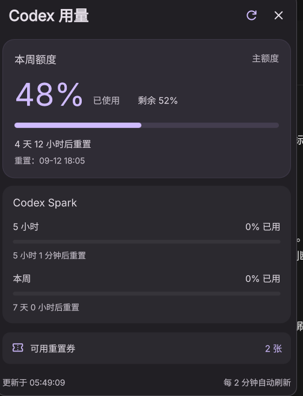

# Codex Meter

在 DankMaterialShell 顶栏查看 Codex 账号额度、剩余比例与重置时间。

[GitHub](https://github.com/FengYing1314/codexMeter) · [MIT 许可证](LICENSE) · [参与贡献](CONTRIBUTING.md)



## 功能

- 紧凑顶栏，显示已用百分比和额度周期。
- 主额度卡片，展示已用、剩余比例及重置倒计时。
- 按模型分组展示额外额度，例如 Codex Spark。
- 查询可用重置券数量。
- 手动刷新及 1、2、5、15 分钟自动刷新。
- 多屏共享短时缓存，查询失败时明确标记旧数据。
- 适配 DMS 主题，界面使用简体中文。

## 环境要求

- Linux / Wayland，已运行 DankMaterialShell 和 Quickshell。
- Python 3.11 或更高版本，无需安装额外 Python 包。
- 已在 Codex 中登录 ChatGPT 账号。API Key 登录不适用于账号额度查询。
- 官方 Codex CLI 用于处理需要刷新的登录状态，需能从 DMS 进程的环境中找到。

已在 Fedora 44、DMS 1.6.0 和 Niri 26.04 环境验证。其他发行版及合成器尚未实测。

## 安装

```sh
git clone https://github.com/FengYing1314/codexMeter.git
cd codexMeter
sh install.sh
```

安装脚本会把当前仓库链接到 `${XDG_CONFIG_HOME:-~/.config}/DankMaterialShell/plugins/codexMeter`。
它不会覆盖已有安装。请保留仓库目录，移动或删除它会使安装链接失效。

然后：

1. 打开 DMS 设置 → 插件，启用 **Codex 用量**。
2. 打开 DankBar 设置，将 **Codex 用量** 加入顶栏。
3. 点击顶栏组件查看详细额度。

若插件列表没有刷新，可运行：

```sh
dms ipc call plugin-scan scan
```

## 配置

在插件设置中选择刷新间隔，默认 **2 分钟**。面板右上角的刷新按钮可立即查询；10 秒内的重复查询可能复用刚取得的结果。

以下环境变量需对 **DMS 进程**可见：

| 变量 | 用途 | 默认值 |
| --- | --- | --- |
| `CODEX_HOME` | Codex 配置及登录目录 | `~/.codex` |
| `CODEX_METER_CLI` | 官方 Codex 可执行文件绝对路径，可选 | 自动查找 |
| `XDG_CONFIG_HOME` | 安装脚本使用的配置根目录 | `~/.config` |
| `XDG_CACHE_HOME` | 查询缓存根目录 | `~/.cache` |

CLI 优先使用 `CODEX_METER_CLI`，然后从 `PATH` 查找；同时兼容 Linux 桌面应用的捆绑安装路径。详细流程见 [工作方式](docs/architecture.md)。

## 更新与卸载

更新仓库后，重新加载插件：

```sh
dms ipc call plugins reload codexMeter
```

卸载前先从 DankBar 移除组件，并在插件设置中禁用它。使用安装脚本安装时，只需删除链接：

```sh
unlink "${XDG_CONFIG_HOME:-$HOME/.config}/DankMaterialShell/plugins/codexMeter"
```

此操作不会删除源码或 Codex 登录状态。

## 常见问题

**提示暂不可用或登录失效**

确认 Codex 使用的是 ChatGPT 账号登录，并检查网络。需要刷新认证时，还需确保 DMS 能找到官方 Codex 程序。可以在终端运行 `python3 -B collect.py` 查看过滤后的查询结果；终端与桌面服务可能使用不同的环境变量。

**只显示周额度**

这是服务端当前返回的额度窗口。没有返回的窗口不会显示为 0%。

**为什么看到旧数据**

查询失败时，面板保留上次成功的数据并显示提示，恢复连接后会自动更新。

**自定义服务地址是否支持**

目前仅支持默认官方 ChatGPT 服务。检测到 `chatgpt_base_url` 覆盖时会报错。账号额度接口并非稳定的公共平台 API，后续字段变化可能需要更新插件。

## 开发

```sh
python3 -B -m unittest discover -s tests -v
sh -n install.sh
python3 -m json.tool plugin.json > /dev/null
```

测试使用合成数据和临时目录，不需要真实账号或网络访问。更多说明见 [CONTRIBUTING.md](CONTRIBUTING.md)。

```text
.
├── Meter.qml              # 顶栏与额度面板
├── Settings.qml           # 插件设置
├── collect.py             # 额度采集
├── plugin.json            # DMS 清单
├── install.sh             # 安装脚本
├── tests/                 # 离线测试
├── docs/                  # 截图与工作方式
└── .github/workflows/     # 自动检查
```

## 许可证

[MIT](LICENSE) © 2026 [FengYing1314](https://github.com/FengYing1314)。
